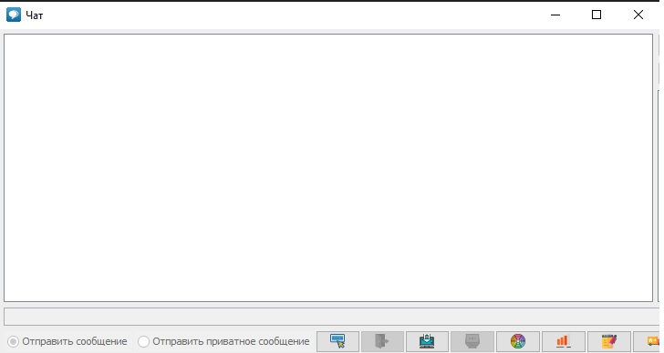
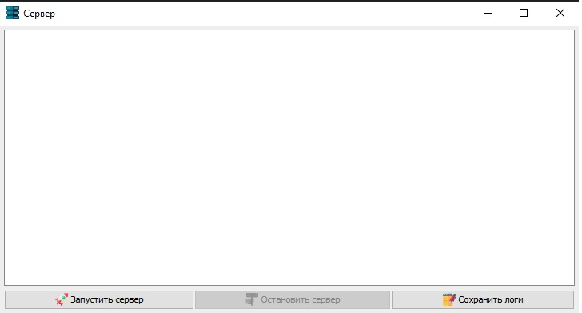

____

# Многопоточный асинхронный сетевой чат
*Курсовой проект многопоточность*

### Технические характеристики
- Java: 17
- Сборщик: Maven
- VCS: Github
- Lombok
- Swing
- JDBC
- SQLLite

## Функциональность

#### Регистрация
- Пользователь может зарегистрироваться, но если есть пользователь с таким именем, регистрация не удастся.

#### Авторизация
- Возможность залогиниться, используя свое имя пользователя и пароль. После входа в систему будет возможно войти на сервер.

#### Личные сообщение
- Возможность отправить личное сообщение пользователю, а также получить личное сообщение от пользователя.

#### Логи
- На стороне сервера сервер может отслеживать всю информацию.

#### Запуск/Остановка сервера
- В окне сервера можно запустить или закрыть сервер вручную.

#### База данных
- Все пользовательские данные хранятся в базе данных.
- Все сообщения пользователей будут записываться в базу данных, в том числе личные.

___

- Возможность изменить цвет сообщения.
- Возможность отключить уведомления.
- Возможность сохранить сообщение журнала.
- Возможность изменить ник в чате, и все пользователи увидят это.

## Чат
- 

---

## Сервер
- 

---
